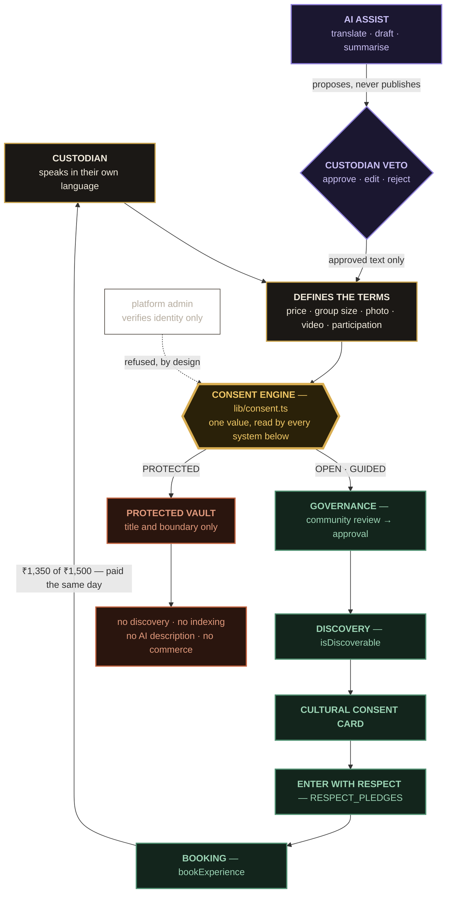

<div align="center">

# KALAVERSE

### Culture on Their Terms.

**The digital ownership and consent layer for cultural tourism.**

*The tourist chooses the experience. The custodian chooses the terms.*

<br>


**[The 3-minute demo](#the-3-minute-demo)** · **[Architecture](#architecture)** · **[Rules enforced in code](#rules-enforced-in-code)** · **[What we refused to build](#what-we-deliberately-did-not-build)**

</div>

---

## Read this paragraph and you understand the whole project

Every cultural-tourism platform on earth starts with the same question: *what can a visitor book?* By the time the artist, the weaver, the priest or the elder is consulted, the price, the photographs, the category and the description have already been decided by someone else.

Kalaverse inverts the order of operations. The custodian speaks first, in their own language. They set the price, the group size, whether a camera may be raised, and — crucially — whether the practice appears on the internet **at all**. Everything downstream, including the AI, is a consumer of that decision and cannot overrule it.

> **If a community cannot control it, Kalaverse does not publish it.**

This is not a marketplace with an ethics page bolted on. The consent value is a **hard gate in the code path**, checked again inside the store before a booking is allowed to exist. You can verify every claim on this page by opening the file named beside it.

---

## The reversal

<table>
<tr>
<th width="50%">Conventional platform</th>
<th width="50%">Kalaverse</th>
</tr>
<tr>
<td valign="top">

```
Tourist demand
      ↓
Platform creates listing
      ↓
Platform writes description
      ↓
Booking
      ↓
Consumption
```

The custodian appears at step four — as a supplier.

</td>
<td valign="top">

```
Custodian
      ↓
Defines terms + access level
      ↓
Approves every published word
      ↓
Community review
      ↓
Visitor enters, on those terms
      ↓
Custodian earns, transparently
      ↓
What must stay private, stays private
```

The custodian is step one, and holds the veto at every step after.

</td>
</tr>
</table>

---

## The Cultural Consent Card

The signature object of the product. Every listing carries one, and it is authored by the custodian — never generated, never rewritten, never "optimised for conversion."

```
┌─────────────────────────────────────────────────┐
│  CULTURAL CONSENT CARD                          │
│  Yakshagana — Beyond the Stage                  │
│  🟡 GUIDED                                       │
├─────────────────────────────────────────────────┤
│  ACCESS            Guided                       │
│  PHOTOGRAPHY       Not allowed                  │
│  VIDEO             Not allowed                  │
│  AUDIO RECORDING   Not allowed                  │
│  PARTICIPATION     Custodian guided             │
│  MAXIMUM GROUP     10                           │
│  LANGUAGE          Kannada + English            │
│  PRICE             ₹1,500                       │
├─────────────────────────────────────────────────┤
│  These terms were defined by the                │
│  cultural custodian.                            │
└─────────────────────────────────────────────────┘
```

### The three access levels

| | Level | Visitor sees | Bookable | Search-indexed | AI may describe it |
|:--|:--|:--|:--|:--|:--|
| 🟢 | **OPEN** | Full listing | Yes | Yes | Only with custodian approval |
| 🟡 | **GUIDED** | Full listing + conditions | Yes, after the Respect pledge | Yes | Only with custodian approval |
| 🔴 | **PROTECTED** | **Nothing at all** | **No** | **No** | **Never — the AI is disabled** |

Flipping a listing from GUIDED to PROTECTED removes it from discovery **immediately**. No ticket, no review queue, no waiting on the platform. Releasing it back out requires the custodian to reconfirm community consent.

> **Preservation doesn't always mean putting culture online.**

---

## Architecture

The single thing this diagram is here to show: **the consent value is a gate, and every downstream capability — discovery, booking, indexing, AI, commerce — must read it before acting.** The dotted line is the platform admin discovering they have no authority.



**Read the diagram in one sentence:** the custodian's voice enters at the top, the consent engine decides whether it becomes a public listing or a sealed vault entry, the AI can only ever whisper suggestions into the custodian's hands, and 90% of the money loops back to where it started.

Note what the diagram does **not** contain: any arrow from the platform into the consent engine. That absence is the product.

---


Working Prototype:<https://kala-verse-nine.vercel.app/>

Video explaination:<https://drive.google.com/drive/folders/1OTqHqJfcvgiB4lMVuIqg0HLG8wcwnfRP>

In this video: 
Lakshitha,
Likith Shetty,
Samay Shetty,
Manvith Devadiga,
Prarthana

Prototype voiceover and explaination by : Lakshitha 


There is no backend. All state lives in `localStorage` under `kalaverse-demo` and survives refreshes — which is the point: a judge can break the app, book things, protect things, and reload without losing the story.

> **Before you present:** hit **Reset demo data** in the footer (or the custodian sidebar). Do it *every time*. A dashboard already showing your last rehearsal's bookings is the fastest way to lose a demo.

---

## The 3-minute demo

This is the tested path. Follow it in order and the concept explains itself without narration.

| # | Do this | Say this |
|:--|:--|:--|
| **1** | Land on **Home**. Scroll past the hero to *Culture is not content* and *We begin with the custodian.* | "Most platforms begin with the tourist. We begin with the custodian." |
| **2** | Click **Explore Karnataka** | |
| **3** | Open **Yakshagana — Beyond the Stage** | |
| **4** | Point at the **Cultural Consent Card**: GUIDED · photography and video not allowed · max group 10 | "Every experience is published on the custodian's terms — and the terms travel with the listing." |
| **5** | **Continue to book** → on *Enter with respect*, tick the four commitments → **I agree & book** | "A visitor cannot pay before they have agreed to the community's conditions." |
| **6** | Confirmation shows **CST-2026-1042** and **₹1,350 → Custodian**. Press **Switch to custodian mode** | "₹1,350 of ₹1,500. Shown to both sides. Paid the same day." |
| **7** | Dashboard *(Your culture. Your rules.)* — earnings up ₹1,350, new-booking notification | |
| **8** | **Create experience** → **Fill with an example** → choose **🔴 PROTECTED** → **Publish with my terms** | |
| **9** | Press **Check visitor discovery.** The practice is **not** listed, and a notice confirms it was removed from public discovery | **"Preservation doesn't always mean putting culture online."** |
| **10** | Open **AI Assistant.** The draft conflicts with the no-photography rule → press **Reject** → *Rejected by custodian* | **"AI can assist the story. It cannot own it."** |
| **11** | Open **Governance** → **Walk a listing through review** (Custodian → Community Review → Approval → Publish) → **Attempt override** → refused | "The platform facilitates access. It does not own the cultural narrative." |
| **12** | Return to the homepage's final screen | **"The tourist chooses the experience. The custodian chooses the terms."** |

**If you only get 60 seconds:** steps 3, 4, 8, 9. The consent card and the disappearing protected practice are the whole thesis.

---

## Rules enforced in code

Anyone can *claim* custodian-first. This table is the receipt — every row is a guarantee that lives in a named file, not in a pitch deck.

| Guarantee | Enforced in |
|:--|:--|
| Protected experiences never appear in discovery | `isDiscoverable` in `lib/consent.ts`, used by **every** visitor list |
| Protected experiences cannot be booked | `isBookable`, re-checked inside `bookExperience` in `store/kalaverse.ts` |
| Protected content cannot be described by AI | `canUseAI` — `generateAIDraft` and `decideAI` refuse protected items outright |
| AI text requires approve / edit / reject | `components/ai/ai-veto-panel.tsx` — nothing is published on generate |
| Custodians control price, schedule, group size, rules, access and description | Create/edit form, consent manager, My Culture |
| Admins cannot override protection | No admin action exists; governance and admin pages surface the refusal |
| Bookings update custodian earnings | `bookExperience` writes a transaction **and** a notification |
| Visitors accept the custodian's terms before booking | `RESPECT_PLEDGES`, validated in the store as well as in the UI |

Note the pattern: **the UI is never the only guard.** Booking validation, protection checks and the respect pledge are all re-verified in the store, so bypassing the interface does not bypass the consent model. That is the difference between a design mockup and a system.

---

## Screens

**Visitor**

| Route | What it is |
|:--|:--|
| `/` | Home — the argument, told as an editorial scroll |
| `/discover` | Search and filters across public practices |
| `/experiences/[id]` | Detail + the Cultural Consent Card |
| `/experiences/[id]/book` | Enter with Respect |
| `/experiences` | Your bookings and saved practices |
| `/crafts` | Buy directly from the maker |
| `/impact` | What the platform is willing to be measured on |
| `/custodians/[id]` | Public custodian profile, narrative owned by them |
| `/register` | Custodian onboarding |
| `/governance` · `/admin` | Who may approve — and who may not |

**Custodian workspace**

| Route | What it is |
|:--|:--|
| `/custodian` | Dashboard — *Your culture. Your rules.* |
| `/custodian/culture` | Boundary map |
| `/custodian/experiences` | List, `new`, `[id]/edit` |
| `/custodian/consent` | Consent manager — flip access levels live |
| `/custodian/vault` | Protected vault |
| `/custodian/ai` | AI assistant, with the veto |
| `/custodian/earnings` | Transparent economics |
| `/custodian/governance` · `/custodian/profile` | Review workflow, public narrative |

---

## Project structure

```
app/                  routes: (site) for visitors, custodian/ for the workspace
components/ui         shadcn-style primitives on Radix (button, dialog, sheet, switch, tabs…)
components/consent    consent card, access badge and selector, consent fields
components/cultural   illustrated plates, ornaments, trust badges, loading/empty states
components/home       homepage storytelling sections
components/dashboard  custodian workspace screens
components/…          booking, discovery, experience, ai, vault, governance, economics, crafts
data/                 fictional custodians, experiences, products, seed activity
lib/                  consent rules, economics, availability, AI drafting, stats, utils
store/                Zustand store persisted to localStorage, hooks
types/                domain model
```

`lib/consent.ts` is the file to open first. It is small, and it is the whole product.

---

## Stack

**Next.js 16** (App Router, Turbopack) · **React 19** · **TypeScript** · **Tailwind CSS v4** · **Radix primitives** in the shadcn/ui pattern · **Framer Motion** · **Zustand** persisted to localStorage · **Lucide**

Chosen so the prototype is the production path: nothing here has to be thrown away to add a real backend. Swap the Zustand persistence layer for an API and the consent rules in `lib/` move server-side unchanged.

---

## The economics

| | |
|:--|--:|
| Experience price | ₹1,500 |
| Platform service fee (10%) | ₹150 |
| **Custodian receives** | **₹1,350** |

Shown to **both** sides, before the visitor pays and on the custodian's dashboard. Never renegotiated per listing, never deducted silently, never hidden behind "service charges." Paid the same day rather than on a monthly aggregated cycle — which matters enormously to an artisan and not at all to a spreadsheet.

> **Your culture. Your value. Your earnings.**

---

## What we deliberately did not build

Judges trust a team that names its own gaps. These are choices, not oversights.

- **No backend.** State is in `localStorage`. This is a frontend prototype of a *governance model*; a server would have added deployment risk without making the argument any clearer.
- **No real payments.** The split is computed and displayed honestly, but no money moves. UPI integration is the obvious phase two.
- **No real identity verification.** Onboarding shows the *flow* — community endorsement or organisational proof — because verification must ultimately be decided by communities, not by us, and certainly not in 36 hours.
- **No admin override — at all.** We did not build it and then disable it. There is no code path. The governance page exists partly to demonstrate the refusal.
- **Communal cultural claims are unresolved.** When two groups both claim a practice, we do not yet have an answer. Individual custodians first; council co-signing is a phase-two governance build. We would rather say this out loud than pretend it is solved.

---

## Content and cultural respect

This section is not boilerplate. A platform about consent that is careless with culture is a contradiction.

- Every custodian, booking and figure is **fictional demo data**.
- Cultural descriptions are **deliberately general**. Nothing sacred, secret or ritual is described anywhere in this repository.
- **Daivaradhane** and all protected practices appear only as abstract visuals and labels — which is exactly what the product argues for.
- Illustrated plates are the fallback for every visual. Where `data/photos.ts` holds a photograph for a practice, craft or product, that photo is shown instead. **Protected practices have none, and never will.**
- ⚠️ **Before publishing anything:** those photos are loaded from Bing image links for the prototype only. Get permission from the photographers, or swap in your own pictures. A platform about consent should not publish real people's likenesses without it.

---

## Where it goes next

| Phase | What changes |
|:--|:--|
| **Now** | Working frontend, full consent model, complete demo |
| **Next** | Real backend, UPI payouts, append-only consent ledger persisted server-side |
| **Then** | Community-endorsement verification with local cultural bodies; council co-signing for communal practices |
| **Later** | Custodian cooperative — a percentage of platform revenue held in a community-governed fund, because a commission *policy* can be quietly changed and a cooperative *structure* cannot |

---

<div align="center">

### CULTURE IS NOT CONTENT.

It is identity. It is memory. It is livelihood. It is community.

**Kalaverse gives the people who preserve it the power to decide how it lives in the digital world.**

<br>

## THE TOURIST CHOOSES THE EXPERIENCE.
## THE CUSTODIAN CHOOSES THE TERMS.

<br>

*Built for coastal Karnataka and Tulunadu — with the people who keep it in mind at every screen.*

</div>
